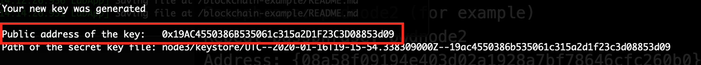
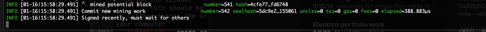
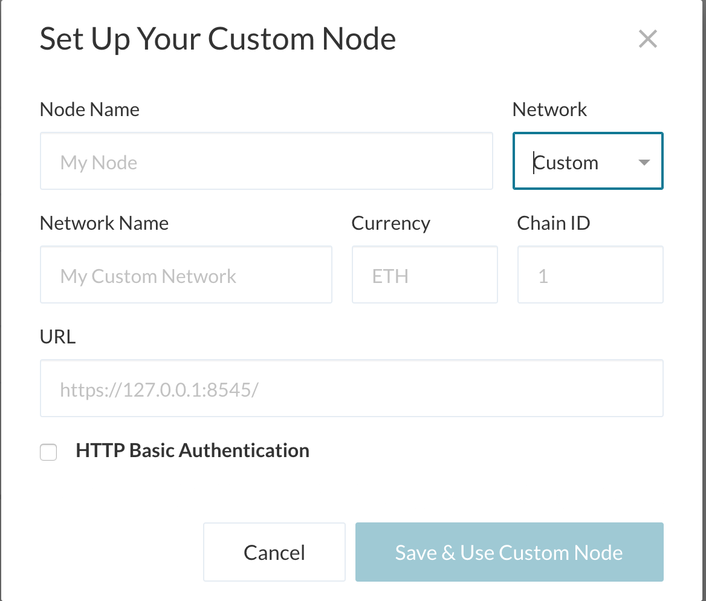
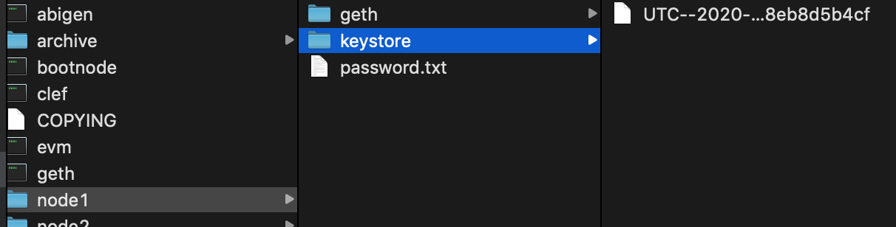
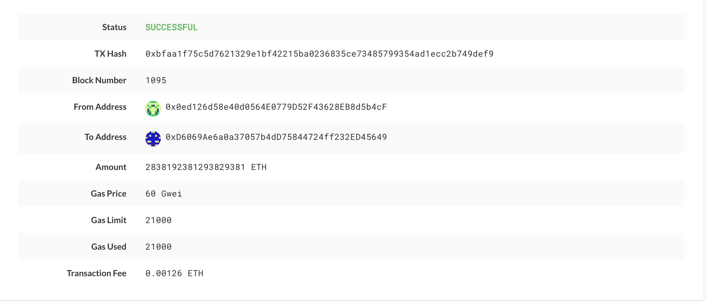

# zBank Blockchain Network

Welcome to the zBank blockchain network. Please follow the guide to get you started to connect to the zBank network to use the blockchain. 

In this guide you will find instructions to:
* Set up your enviornment
* Create a new user account
* Connect to the blockchain
* Start mining
* Send a transaction

## Environment setup instructions and dependencies

Important Note: Windows users **MUST** use git-bash and not the default Windows command prompt when you are requested to open the terminal window to execute commands.

### 1. Installing MyCrypto Desktop App

[MyCrypto](https://www.mycrypto.com/) is a free, open-source, client-side interface that allows you to interact directly with the blockchain.

To install MyCrypto Desktop App, please follow the next steps:

1. Open your browser and navigate to the downloads page at https://download.mycrypto.com/.

2. Depending on your operating system, you will be redirected to the corresponding application installer. If you are not correctly redirected, choose the appropriate installer for your operating system.

3. Once you download the installer, open the file, and follow the installation wizard. 
    
    
### 2. Installing Go Ethereum Tools
Go Ethereum is one of the three original implementations of the Ethereum protocol. It is written in Go, fully open-source and licensed under the GNU LGPL v3.

We will use Go Ethereum Tools to use the zbank blockchain, from the genesis block to mining tokens and making transactions.

Despite there are installers for OS X and Windows, we will use the application executable binary files to have a seamless experience between both operating systems and avoid some technical issues that currently exist in Windows.

To install the Go Ethereum Tools, please follow the next steps:

1. Open your browser and navigate to the Go Ethereum Tools download page at https://geth.ethereum.org/downloads/

2. Scroll down to the "Stable Releases" section and proceed depending on your operating system.

3. Click on the **"Geth & Tools 1.9.7"** to download the applications bundle archive. Depending on your Windows version, you should download the `32 bit` or `64 bit` version of the Go Ethereum Tools.
    
4. After downloading the tools archive, open your "Downloads" folder, and you will find a file named `geth-alltools-darwin-amd64-1.9.7-a718daa6.tar.gz` in OS X, and a file called `geth-alltools-windows-amd64-1.9.7-a718daa6.zip` in Windows. Note that the last numbers in the filename could vary depending on the last built available.
    
5. Decompress the archive in the location of your preference in your computer's hard drive, and rename the containing folder as `Blockchain-Tools`. We recommend using a location that can be easily accessed from the terminal window like the user's home directory.
    
6. You have finished the installation process; you will use these tools to use owr blockchain.

## Connect to the network 

### 1. Create a node account
Create the node's data directory using the `geth` command and a couple of command line flags by running the following line in your terminal window (Git Bash in Windows):

 ```bash
 ./geth account new --datadir "username"
 ``` 
The accounts (also called wallet) hold a private-public key pair that are required for interacting with any blockchain. Any mining node (strictly speaking the nodes will not be mining but voting) needs to be able to sign transactions (using their private key) and to identify itself on the network (the address is derived from the public key).

Therefore the termainal will ask you for a password for your private key. 

Save your address and private key for uses later.

### *Remember, never share your mainnet private keys!*

You can find your address here on the confirmation of account creation. 



You will need to provide your address to a verified signer to get you voted in and accepted on the blockchain and initated. 


### 2. Initate the node

Once you have an account you can use this moving forward and will not need to recreate another account. 

Initialize the node, replacing `yournetworkname.json` with the network json and node_name with the folder of your account:

 ```bash
 ./geth init yournetworkname.json --datadir "username"
 ```
### 3. Connect to the chain 
Navigate to your `Blockchain-Tools` folder and follow the next steps.

To launch node you will need to enable RPC, change the sync port, and pass the `enode://` address of the first node in quotes by running the following command (it will differ in Windows and OS X):

 * Running in OS X:
 ```bash
 ./geth --datadir "username" --port 30304 --rpc --bootnodes "enode://<replace with node1 enode address>" --minerthreads 1 --unlock "username_address" --mine
 ```


 * Running in Microsoft Windows:
 ```bash
 ./geth --datadir "username" --port "#" --rpc --bootnodes "enode://<replace with node1 enode address>" --ipcdisable --minerthreads 1 --unlock "username_address" --mine
 ```
 
 
 Update the following: 

 ```bash
 - "Username"- name of user and folder when creating the account
 - "#" - this should be the port number that is different than the original port number on your computer
 - "enode://" - enode address of the original node that should be provided
 - "username_address" - address created when the account was first created
 ```

Congrats, you should now be mining on the zbank blockchain. 

Your screen should look like: 



#### Notes
If you ever encounter strange errors, or need to start over without destroying the accounts, run the following command to clear the chain data (this will reset the `enode` addresses as well):

  ```bash
  rm -Rf node1/geth node2/geth
  ```

#### Geth flags

* The `--rpc` flag enables us to talk to our second node, which will allow us to use MyCrypto or Metamask to transact on our chain.

* Since the first node's sync port already took up `30303`, we need to change this one to `30304` using `--port`.

* The `--bootnodes` flag allows you to pass the network info needed to find other nodes in the blockchain. This will allow us to connect both of our nodes.

* In Microsoft Windows, we need to add the flag `--ipcdisable` due to the way Windows spawns new IPC/Unix sockets doesn't allow for having multiple sockets running from `geth` at once. Since we are only using `RCP` we can safely disable the `IPC` sockets.

* The `--mine` flag initates the mining.

* The `--minerthreads` flag defines the number of CPU threads to use for mining with a default of 0.


## Using MyCrypto

For the nodes to transact with each other, we will use MyCrypto to send and recieve coins from our wallets.

### Connect MyCrypto to the network

1. Open MyCrypto and click on "Change Network" at the bottom of the menu.

2. Scroll down to "Add Custom Node" to 

2. Enter the name of the network and choose `Custom` in the `Network` setting to reveal more options like `Chain ID`. 




3. The chain ID should be provided by the admin and be the same as the original node. 

4. The URL is pointing to the default RPC port on your local machine. Everyone should use this same URL: `http://127.0.0.1:8545`.

5. Click on the "Save & Use Custom Node" button, to use the network; double-check that it is selected and is connected.


### Start a transaction

Now that you are connected to the network and chain, let's make some transactions with your wallet and coins. 


1. Locate the keystore file from your user folder when you first created your account. It should be in the  `username/keystore` directory.



2. Click on View and Send in the menu and on the first screen, locate the Keystore File button to load your private key and wallet. 

3. Enter your keystore file and the private key from when you created the account.

4. Send a transaction. If you have an address from another user, you can send a transaction. Please note that you need more coin than you are sending to cover the fees of the transaction.  If successful you will see a confimation like: 


5. Copy the transaction hash and paste it into the "TX Status" section of the app, or click "TX Status" in the popup to see if the transaction has been processed. 

6. You can view all the transaction status on this screen along with all the notes and details. 




## Current Network and Origin Node Setting

* enode: `enode://23a922604434b8dd575b7cfb3b9467fa24d2ad36f7fcf688858914052b1e0f1b046d045c1e8c85930233abe95d5ebdad54e368eb0372d7dbc196c1b709f4666c@127.0.0.1:0?discport=30303`
* Network Name: `zBank`
* ChainID: `5050`
* Currency: `ETH`
* Current blockchain time: `3 seconds`
* Origin Port: `30303`
* Origin address for test transactions: `0x0ed126d58e40d0564E0779D52F43628EB8d5b4cF`


---
###### *By: RY CU-NYC-FIN-PT-08-2019-U-C 2020*